# HIS-DAO-CARE: Agent Architecture & Orchestration Strategy

Tài liệu này định nghĩa cấu trúc phân chia nhiệm vụ cho các Agent (AI Assistant) tham gia phát triển hệ thống **HIS-DAO-CARE** nhằm tối ưu hóa ngữ cảnh (context), tránh bị nén context và hạn chế xung đột code.

---

## 1. Bản Đồ Phân Chia Agent Tổng Thể

```mermaid
graph TD
    Master[Master Agent - Điều Phối Tổng] 
    
    %% Repo Backend
    Master -->|Orchestrates| BE_Repo[Repo: HIS-BE-DAO-CARE]
    subgraph Backend Agent Group
        BE_Repo --> BE_Agent_Org["be-agent-org<br>(Tổ chức, Cơ sở, Nhân sự, Phòng/Tài nguyên)"]
        BE_Repo --> BE_Agent_Auth["be-agent-auth<br>(User, Role, Permission, Audit Log)"]
        BE_Repo --> BE_Agent_Medical["be-agent-medical<br>(Chuyên khoa, Dịch vụ, ICD-10, Thuốc)"]
        BE_Repo --> BE_Agent_Engine["be-agent-engine<br>(Schedules, Workflow, Notification)"]
        BE_Repo --> BE_Agent_Forms["be-agent-forms<br>(Form Builder & Clinical Template)"]
    end

    %% Repo Frontend Admin
    Master -->|Orchestrates| FE_Repo[Repo: HIS_FE]
    subgraph Frontend Agent Group
        FE_Repo --> FE_Agent_Org["fe-agent-org<br>(UI Quản lý cơ cấu & Cơ sở)"]
        FE_Repo --> FE_Agent_Auth["fe-agent-auth<br>(UI Phân quyền & User)"]
        FE_Repo --> FE_Agent_Medical["fe-agent-medical<br>(UI Quản lý dịch vụ & ICD)"]
        FE_Repo --> FE_Agent_Engine["fe-agent-engine<br>(UI Quản lý Lịch làm việc & Ca trực)"]
        FE_Repo --> FE_Agent_Forms["fe-agent-forms<br>(UI Form Builder kéo thả)"]
    end

    %% Repo Mobile App
    Master -->|Orchestrates| APP_Repo[Repo: app-dao-care]
    subgraph Patient App Agent Group
        APP_Repo --> APP_Agent_Portal["app-agent-portal<br>(Đặt lịch online, Hồ sơ cá nhân)"]
    end
```

---

## 2. Chi Tiết Nhiệm Vụ & Phạm Vi của Từng Subagent

Dựa theo bản thiết kế thiết lập hệ thống tại [structure.phase1.md](file:///d:/HIS-DAO-CARE/HIS-BE-DAO-CARE/structure.phase1.md):

### Nhóm 1: Cơ Cấu & Nhân Sự (Org & Resources)
*   **Tên Agent**: 
    *   Backend: `be-agent-org`
    *   Frontend: `fe-agent-org`
*   **Phạm vi chức năng**:
    *   **Tổ chức**: Cấu hình thông tin cơ bản, pháp lý, định dạng hệ thống, định danh mã (MRN, Patient, Visit).
    *   **Cơ sở**: Tạo, sửa, thiết lập giờ làm việc, GPS của chi nhánh.
    *   **Phòng & Tài nguyên**: Cấu hình danh mục phòng khám, giường/ghế điều trị, thiết bị y tế y khoa.
    *   **Nhân sự**: Quản lý hồ sơ nhân viên, chức danh lâm sàng/hành chính, chứng chỉ hành nghề, phân công công tác.

### Nhóm 2: Xác Thực & Phân Quyền (Auth & Security)
*   **Tên Agent**:
    *   Backend: `be-agent-auth`
    *   Frontend: `fe-agent-auth`
*   **Phạm vi chức năng**:
    *   **Tài khoản**: Tạo, sửa, khóa, mở khóa, OTP/2FA, cơ chế chính sách bảo mật.
    *   **Quyền**: Quản lý vai trò (Admin, Reception, Doctor...), phân quyền chức năng CRUD, phân quyền dữ liệu theo cơ sở/chuyên khoa/phòng ban.
    *   **Nhật ký**: Audit log đăng nhập, audit log lịch sử thao tác dữ liệu.

### Nhóm 3: Danh Mục Y Tế & Dịch Vụ (Medical Catalog)
*   **Tên Agent**:
    *   Backend: `be-agent-medical`
    *   Frontend: `fe-agent-medical`
*   **Phạm vi chức năng**:
    *   **Chuyên khoa**: Thiết lập danh mục các chuyên khoa (Nội, Ngoại, Sản, Nhi, Nha...).
    *   **Dịch vụ (Service Catalog)**: Khám bệnh, Xét nghiệm, Chẩn đoán hình ảnh, Thăm dò chức năng, Thủ thuật & Phẫu thuật. Cấu hình thời gian thực hiện, tài nguyên, và bảng giá dịch vụ (giá niêm yết, BHYT, VIP, VAT).
    *   **Danh mục ICD-10**: Mapping mã bệnh y tế.
    *   **Danh mục Thuốc**: Tên thuốc, hoạt chất, hàm lượng, đơn vị, mã liên thông quốc gia.

### Nhóm 4: Quy Trình Vận Hành & Lịch Hẹn (Workflows & Schedules)
*   **Tên Agent**:
    *   Backend: `be-agent-engine`
    *   Frontend: `fe-agent-engine`
*   **Phạm vi chức năng**:
    *   **Lịch làm việc**: Thiết lập ca làm việc, slot lịch hẹn (theo bác sĩ/dịch vụ, overbook limit), đăng ký ngày nghỉ của nhân sự.
    *   **Quy trình (Workflow Engine)**: Quản lý trạng thái cuộc hẹn (Booked -> Completed) và lượt khám (Visit), quy tắc điều phối phân phòng tự động.
    *   **Thông báo**: Quản lý trigger gửi SMS Brandname, Zalo ZNS, Email.
    *   **Tích hợp**: Cấu hình cổng kết nối thanh toán (VietQR dynamic, VNPay) và thiết bị y tế (PACS, LIS).

### Nhóm 5: Tùy Biến Biểu Mẫu (Form Builder)
*   **Tên Agent**:
    *   Backend: `be-agent-forms`
    *   Frontend: `fe-agent-forms`
*   **Phạm vi chức năng**:
    *   **Form Builder**: Xây dựng bộ công cụ kéo thả/cấu hình động biểu mẫu lâm sàng (SOAP, phiếu khám chuyên khoa), biểu mẫu hành chính (cam kết, đồng ý điều trị). Quản lý phiên bản form (Versioning) và vẽ tổn thương (Canvas Drawing).
    *   **Cấu hình mẫu in**: Thiết lập Header/Footer của phiếu chỉ định, phiếu kết quả cận lâm sàng, hóa đơn, đơn thuốc điện tử.

---

## 3. Quy Tắc Phối Hợp & Giao Tiếp (Rules of Engagement)

1.  **Thiết kế API Contract trước khi Code**: Master Agent thiết lập Schema/Swagger chung giữa BE & FE để các Subagent làm việc độc lập mà không bị lệch API.
2.  **Một Agent - Một Context**: Khi thực hiện nhiệm vụ ở module nào, chỉ gọi Subagent phụ trách module đó và truyền context tương ứng. Không gom tất cả các tệp vào ngữ cảnh của Agent.
3.  **Ghi chú vào Git Commit**: Mọi commit cần chỉ rõ tên Agent thực hiện để phục vụ kiểm soát code (ví dụ: `[be-agent-auth] add middleware check permission`).
