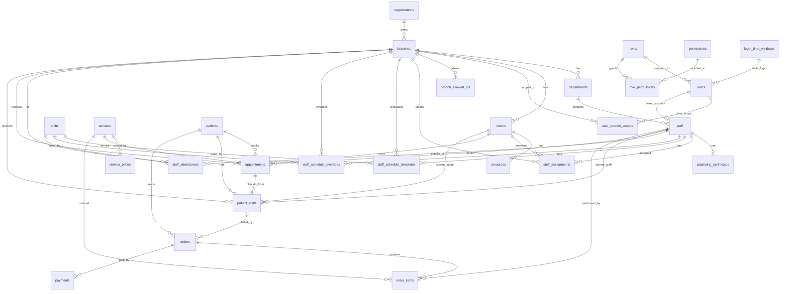

# HIS DAO Care - Database schema

Nguon doc: TypeORM migrations trong `src/infrastructure/database/migrations`, TypeORM entities trong `src/modules/**/infrastructure/database`, va mot so DTO/use-case de dien giai y nghia nghiep vu.

Schema PostgreSQL trong migration: `his`.

## Quy uoc

- `PK`: khoa chinh.
- `FK(DB)`: khoa ngoai da duoc migration tao constraint trong DB.
- `FK(logic)`: cot luu id va code dang su dung nhu quan he, nhung migration/entity chua tao FK DB.
- `UQ`: unique constraint. Trong PostgreSQL, unique constraint tuong duong unique index.
- `IDX`: non-unique index tao ro bang `CREATE INDEX`.
- Cac cot `status`, `type`, `category`, `title`, `gender` hien la `varchar`, chua co `CHECK constraint` hoac enum DB.
- Hau het bang co `id uuid DEFAULT uuid_generate_v4()` lam PK. De chay duoc migration can co schema `his` va extension/function `uuid_generate_v4()`.

## ERD quan he chinh

## Quan he logic chua co FK DB

| Cot | Quan he logic | Ghi chu |
| --- | --- | --- |
| `rooms.specialty_id` | `specialties.id` | Entity chi khai bao column, migration chua co FK. |
| `staff_assignments.specialty_id` | `specialties.id` | Dung de gan nhan su theo chuyen khoa, chua co FK. |
| `services.specialty_id` | `specialties.id` | Danh muc dich vu theo chuyen khoa, chua co FK. |
| `icd10_codes.specialty_id` | `specialties.id` | Ma ICD-10 theo chuyen khoa, chua co FK. |
| `users.locked_by` | Co the tham chieu user/admin khoa tai khoan | Chua co FK hoac entity relation. |

## Index tong hop

| Bang | Index/constraint | Cot | Loai |
| --- | --- | --- | --- |
| Tat ca bang chinh | Primary key | `id` | `PK`, implicit btree index |
| `role_permissions` | `PK_25d24010f53bb80b78e412c9656` | `role_id`, `permission_id` | composite PK |
| `role_permissions` | `IDX_178199805b901ccd220ab7740e` | `role_id` | explicit non-unique index |
| `role_permissions` | `IDX_17022daf3f885f7d35423e9971` | `permission_id` | explicit non-unique index |
| `permissions` | `UQ_permissions_name` | `name` | unique |
| `roles` | `UQ_roles_name` | `name` | unique |
| `users` | `UQ_users_email`, `UQ_users_username` | `email`, `username` | unique |
| `user_branch_scopes` | `UQ_user_branch_scopes_pair` | `user_id`, `branch_id` | unique |
| `organizations` | `UQ_organizations_code` | `code` | unique |
| `branches` | `UQ_branches_code` | `code` | unique |
| `departments` | `UQ_department_code` | `code` | unique |
| `rooms` | `UQ_rooms_code` | `code` | unique |
| `resources` | `UQ_resources_code` | `code` | unique |
| `staff` | unique constraints | `identity_number`, `email`, `staff_code`, `user_id` | unique |
| `practicing_certificates` | unique constraints | `staff_id`, `certificate_number` | unique |
| `specialties` | `UQ_specialties_code` | `code` | unique |
| `services` | `UQ_services_code` | `code` | unique |
| `icd10_codes` | `UQ_icd10_codes_code` | `code` | unique |
| `medications` | unique constraints | `code`, `national_code` | unique |
| `form_templates` | `UQ_form_templates_code` | `code` | unique |
| `patients` | unique constraints | `patient_code`, `phone` | unique |
| `appointments` | `UQ_appointments_appointment_code` | `appointment_code` | unique |
| `patient_visits` | `UQ_patient_visits_visit_code` | `visit_code` | unique |
| `orders` | `UQ_orders_order_code` | `order_code` | unique |
| `payments` | `UQ_payments_payment_code` | `payment_code` | unique |

## Chi tiet bang

### `his.permissions`

Y nghia: danh muc quyen thao tac trong he thong.

| Field | Dang | Null/default | Key/index | Y nghia |
| --- | --- | --- | --- | --- |
| `id` | `uuid` | NOT NULL, `uuid_generate_v4()` | PK | Dinh danh quyen. |
| `name` | `varchar` | NOT NULL | UQ | Ma quyen, vi du `user:create`, `patient:read`. |
| `description` | `varchar` | NULL |  | Mo ta quyen. |

Quan he: N-N voi `roles` qua `role_permissions`.

### `his.roles`

Y nghia: nhom vai tro nguoi dung.

| Field | Dang | Null/default | Key/index | Y nghia |
| --- | --- | --- | --- | --- |
| `id` | `uuid` | NOT NULL, `uuid_generate_v4()` | PK | Dinh danh vai tro. |
| `name` | `varchar` | NOT NULL | UQ | Ma vai tro, vi du `ADMIN`, `DOCTOR`, `RECEPTION`, `NURSE`. |
| `description` | `varchar` | NULL |  | Mo ta vai tro. |

Quan he: 1-N voi `users`; N-N voi `permissions` qua `role_permissions`.

### `his.role_permissions`

Y nghia: bang noi vai tro va quyen.

| Field | Dang | Null/default | Key/index | Y nghia |
| --- | --- | --- | --- | --- |
| `role_id` | `uuid` | NOT NULL | PK, FK(DB) -> `roles.id`, IDX | Vai tro duoc gan quyen. |
| `permission_id` | `uuid` | NOT NULL | PK, FK(DB) -> `permissions.id`, IDX | Quyen duoc gan vao vai tro. |

Quan he: moi dong gan 1 permission cho 1 role; xoa `roles` se cascade bang noi.

### `his.users`

Y nghia: tai khoan dang nhap va chinh sach truy cap.

| Field | Dang | Null/default | Key/index | Y nghia |
| --- | --- | --- | --- | --- |
| `id` | `uuid` | NOT NULL, `uuid_generate_v4()` | PK | Dinh danh user. |
| `email` | `varchar` | NOT NULL | UQ | Email dang nhap/lien he. |
| `username` | `varchar` | NULL | UQ | Ten dang nhap ngan gon. |
| `password_hash` | `varchar` | NOT NULL |  | Mat khau da hash. |
| `refresh_token_hash` | `varchar` | NULL |  | Refresh token da hash. |
| `is_active` | `boolean` | NOT NULL, default `true` |  | Tai khoan dang hoat dong hay bi vo hieu hoa. |
| `role_id` | `uuid` | NOT NULL | FK(DB) -> `roles.id` | Vai tro cua user. |
| `default_branch_id` | `uuid` | NULL | FK(DB) -> `branches.id`, ON DELETE SET NULL | Chi nhanh mac dinh. |
| `branch_scope_mode` | `varchar` | NOT NULL, default `SPECIFIC` |  | Che do pham vi chi nhanh, vi du `SPECIFIC` hoac logic tuong duong. |
| `bypass_ip_restriction` | `boolean` | NOT NULL, default `true` |  | Bo qua kiem tra IP cho user nay. |
| `login_time_window_id` | `uuid` | NULL | FK(DB) -> `login_time_windows.id`, ON DELETE SET NULL | Khung gio duoc phep dang nhap. |
| `failed_login_count` | `integer` | NOT NULL, default `0` |  | So lan dang nhap sai. |
| `failed_login_limit` | `integer` | NULL |  | Gioi han dang nhap sai rieng user. |
| `locked_at` | `timestamp` | NULL |  | Thoi diem khoa tai khoan. |
| `locked_by` | `uuid` | NULL | FK(logic) | Nguoi thao tac khoa tai khoan, chua enforce FK. |
| `lock_reason` | `varchar` | NULL |  | Ly do khoa. |
| `created_at` | `timestamp` | NOT NULL, default `now()` |  | Thoi diem tao. |
| `updated_at` | `timestamp` | NOT NULL, default `now()` |  | Thoi diem cap nhat. |

Quan he: N-1 `roles`; N-1 `branches` qua `default_branch_id`; N-1 `login_time_windows`; 1-N `user_branch_scopes`; 0/1-0/1 voi `staff` qua `staff.user_id`.

### `his.login_time_windows`

Y nghia: cau hinh khung gio dang nhap.

| Field | Dang | Null/default | Key/index | Y nghia |
| --- | --- | --- | --- | --- |
| `id` | `uuid` | NOT NULL, `uuid_generate_v4()` | PK | Dinh danh khung gio. |
| `name` | `varchar` | NOT NULL |  | Ten khung gio. |
| `start_time` | `varchar` | NOT NULL |  | Gio bat dau, vi du `06:00`. |
| `end_time` | `varchar` | NOT NULL |  | Gio ket thuc, vi du `21:00`. |
| `is_active` | `boolean` | NOT NULL, default `true` |  | Con ap dung hay khong. |
| `created_at` | `timestamp` | NOT NULL, default `now()` |  | Thoi diem tao. |
| `updated_at` | `timestamp` | NOT NULL, default `now()` |  | Thoi diem cap nhat. |

Quan he: 1-N `users`.

### `his.user_branch_scopes`

Y nghia: pham vi chi nhanh user duoc truy cap.

| Field | Dang | Null/default | Key/index | Y nghia |
| --- | --- | --- | --- | --- |
| `id` | `uuid` | NOT NULL, `uuid_generate_v4()` | PK | Dinh danh scope. |
| `user_id` | `uuid` | NOT NULL | FK(DB) -> `users.id`, UQ pair | User duoc cap pham vi. |
| `branch_id` | `uuid` | NOT NULL | FK(DB) -> `branches.id`, UQ pair | Chi nhanh duoc phep truy cap. |
| `created_at` | `timestamp` | NOT NULL, default `now()` |  | Thoi diem tao scope. |

Quan he: N-1 `users`, N-1 `branches`; cap `user_id + branch_id` la duy nhat.

### `his.branch_allowed_ips`

Y nghia: danh sach IP duoc phep dang nhap theo chi nhanh.

| Field | Dang | Null/default | Key/index | Y nghia |
| --- | --- | --- | --- | --- |
| `id` | `uuid` | NOT NULL, `uuid_generate_v4()` | PK | Dinh danh cau hinh IP. |
| `branch_id` | `uuid` | NOT NULL | FK(DB) -> `branches.id`, ON DELETE CASCADE | Chi nhanh ap dung. |
| `ip_address` | `varchar` | NOT NULL |  | Dia chi IP duoc phep. |
| `description` | `varchar` | NULL |  | Mo ta IP. |
| `is_active` | `boolean` | NOT NULL, default `true` |  | Dang ap dung hay khong. |
| `created_at` | `timestamp` | NOT NULL, default `now()` |  | Thoi diem tao. |
| `updated_at` | `timestamp` | NOT NULL, default `now()` |  | Thoi diem cap nhat. |

Quan he: N-1 `branches`.

### `his.organizations`

Y nghia: phap nhan/to chuc chu quan cua he thong phong kham.

| Field | Dang | Null/default | Key/index | Y nghia |
| --- | --- | --- | --- | --- |
| `id` | `uuid` | NOT NULL, `uuid_generate_v4()` | PK | Dinh danh to chuc. |
| `name` | `varchar` | NOT NULL |  | Ten day du. |
| `short_name` | `varchar` | NULL |  | Ten viet tat. |
| `code` | `varchar` | NOT NULL | UQ | Ma to chuc. |
| `logo_url` | `varchar` | NULL |  | URL logo. |
| `tax_code` | `varchar` | NULL |  | Ma so thue. |
| `operating_license` | `varchar` | NULL |  | Giay phep hoat dong. |
| `legal_representative` | `varchar` | NULL |  | Nguoi dai dien phap ly. |
| `hotline` | `varchar` | NULL |  | So hotline. |
| `email` | `varchar` | NULL |  | Email lien he. |
| `website` | `varchar` | NULL |  | Website. |
| `address` | `varchar` | NULL |  | Dia chi to chuc. |
| `language` | `varchar` | NOT NULL, default `vi` |  | Ngon ngu mac dinh. |
| `timezone` | `varchar` | NOT NULL, default `Asia/Ho_Chi_Minh` |  | Mui gio mac dinh. |
| `country` | `varchar` | NOT NULL, default `VN` |  | Quoc gia. |
| `default_currency` | `varchar` | NOT NULL, default `VND` |  | Tien te mac dinh. |
| `date_format` | `varchar` | NOT NULL, default `YYYY-MM-DD` |  | Dinh dang ngay. |
| `time_format` | `varchar` | NOT NULL, default `HH:mm:ss` |  | Dinh dang gio. |
| `currency_format` | `varchar` | NOT NULL, default `standard` |  | Cach hien thi tien te. |
| `otp_expiration_time` | `integer` | NOT NULL, default `300` |  | Thoi gian het han OTP, tinh bang giay. |
| `appointment_cancellation_limit` | `integer` | NOT NULL, default `24` |  | Gioi han huy lich hen, tinh bang gio. |
| `mrn_format` | `varchar` | NOT NULL, default `MRN-{YY}{MM}{DD}-{SEQ}` |  | Format ma ho so/y te. |
| `patient_code_format` | `varchar` | NOT NULL, default `PT-{YY}{MM}-{SEQ}` |  | Format ma benh nhan. |
| `visit_code_format` | `varchar` | NOT NULL, default `VS-{YY}{MM}{DD}-{SEQ}` |  | Format ma luot kham. |
| `created_at` | `timestamp` | NOT NULL, default `now()` |  | Thoi diem tao. |
| `updated_at` | `timestamp` | NOT NULL, default `now()` |  | Thoi diem cap nhat. |

Quan he: 1-N `branches`.

### `his.branches`

Y nghia: co so/chi nhanh phong kham.

| Field | Dang | Null/default | Key/index | Y nghia |
| --- | --- | --- | --- | --- |
| `id` | `uuid` | NOT NULL, `uuid_generate_v4()` | PK | Dinh danh chi nhanh. |
| `organization_id` | `uuid` | NOT NULL | FK(DB) -> `organizations.id`, ON DELETE CASCADE | To chuc chu quan. |
| `name` | `varchar` | NOT NULL |  | Ten chi nhanh. |
| `code` | `varchar` | NOT NULL | UQ | Ma chi nhanh. |
| `type` | `varchar` | NOT NULL, default `CLINIC` |  | Loai co so. |
| `technical_director` | `varchar` | NULL |  | Nguoi phu trach chuyen mon. |
| `operating_license` | `varchar` | NULL |  | Giay phep hoat dong chi nhanh. |
| `is_active` | `boolean` | NOT NULL, default `true` |  | Trang thai hoat dong. |
| `hotline` | `varchar` | NULL |  | Hotline chi nhanh. |
| `email` | `varchar` | NULL |  | Email chi nhanh. |
| `country` | `varchar` | NOT NULL, default `VN` |  | Quoc gia. |
| `province` | `varchar` | NULL |  | Tinh/thanh. |
| `district` | `varchar` | NULL |  | Quan/huyen. |
| `address_detail` | `varchar` | NULL |  | Dia chi chi tiet. |
| `google_map_url` | `varchar` | NULL |  | Duong dan Google Map. |
| `working_days` | `text` | NULL |  | Danh sach ngay lam viec; entity dung `simple-array`. |
| `open_time` | `varchar` | NOT NULL, default `08:00` |  | Gio mo cua. |
| `close_time` | `varchar` | NOT NULL, default `20:00` |  | Gio dong cua. |
| `bank_name` | `varchar` | NULL |  | Ten ngan hang. |
| `bank_account_no` | `varchar` | NULL |  | So tai khoan ngan hang. |
| `bank_account_name` | `varchar` | NULL |  | Ten chu tai khoan. |
| `created_at` | `timestamp` | NOT NULL, default `now()` |  | Thoi diem tao. |
| `updated_at` | `timestamp` | NOT NULL, default `now()` |  | Thoi diem cap nhat. |

Quan he: N-1 `organizations`; 1-N voi `departments`, `rooms`, `staff_assignments`, `appointments`, `patient_visits`, `staff_attendances`, `branch_allowed_ips`, `user_branch_scopes`, `staff_schedule_templates`, `staff_schedule_overrides`.

### `his.departments`

Y nghia: phong ban/bo phan trong chi nhanh.

| Field | Dang | Null/default | Key/index | Y nghia |
| --- | --- | --- | --- | --- |
| `id` | `uuid` | NOT NULL, `uuid_generate_v4()` | PK | Dinh danh phong ban. |
| `branch_id` | `uuid` | NULL | FK(DB) -> `branches.id`, ON DELETE SET NULL | Chi nhanh truc thuoc. |
| `name` | `varchar` | NOT NULL |  | Ten phong ban. |
| `code` | `varchar` | NOT NULL | UQ | Ma phong ban. |
| `description` | `varchar` | NULL |  | Mo ta. |
| `is_active` | `boolean` | NOT NULL, default `true` |  | Trang thai hoat dong. |
| `created_at` | `timestamp` | NOT NULL, default `now()` |  | Thoi diem tao. |
| `updated_at` | `timestamp` | NOT NULL, default `now()` |  | Thoi diem cap nhat. |

Quan he: N-1 `branches`; 1-N `staff`.

### `his.rooms`

Y nghia: phong kham, phong dieu tri, labo, chan doan hinh anh.

| Field | Dang | Null/default | Key/index | Y nghia |
| --- | --- | --- | --- | --- |
| `id` | `uuid` | NOT NULL, `uuid_generate_v4()` | PK | Dinh danh phong. |
| `branch_id` | `uuid` | NOT NULL | FK(DB) -> `branches.id`, ON DELETE CASCADE | Chi nhanh so huu phong. |
| `name` | `varchar` | NOT NULL |  | Ten phong. |
| `code` | `varchar` | NOT NULL | UQ | Ma phong. |
| `type` | `varchar` | NOT NULL, default `CLINIC` |  | Loai phong: `CLINIC`, `TREATMENT`, `PROCEDURE`, `LABORATORY`, `IMAGING`. |
| `specialty_id` | `uuid` | NULL | FK(logic) -> `specialties.id` | Chuyen khoa phu hop. |
| `floor` | `varchar` | NULL |  | Tang/khu vuc. |
| `capacity` | `integer` | NOT NULL, default `1` |  | Suc chua/so benh nhan co the phuc vu. |
| `is_active` | `boolean` | NOT NULL, default `true` |  | Trang thai phong. |
| `created_at` | `timestamp` | NOT NULL, default `now()` |  | Thoi diem tao. |
| `updated_at` | `timestamp` | NOT NULL, default `now()` |  | Thoi diem cap nhat. |

Quan he: N-1 `branches`; 1-N `resources`; 1-N `staff_assignments`; duoc tham chieu boi `appointments` va `patient_visits`.

### `his.resources`

Y nghia: tai nguyen trong phong nhu ghe, giuong, thiet bi.

| Field | Dang | Null/default | Key/index | Y nghia |
| --- | --- | --- | --- | --- |
| `id` | `uuid` | NOT NULL, `uuid_generate_v4()` | PK | Dinh danh tai nguyen. |
| `room_id` | `uuid` | NOT NULL | FK(DB) -> `rooms.id`, ON DELETE CASCADE | Phong chua tai nguyen. |
| `name` | `varchar` | NOT NULL |  | Ten tai nguyen. |
| `code` | `varchar` | NOT NULL | UQ | Ma tai nguyen. |
| `type` | `varchar` | NOT NULL |  | Loai tai nguyen: `CHAIR`, `BED`, `EQUIPMENT`. |
| `is_active` | `boolean` | NOT NULL, default `true` |  | Con su dung hay khong. |
| `is_occupied` | `boolean` | NOT NULL, default `false` |  | Dang bi su dung/ban hay khong. |
| `created_at` | `timestamp` | NOT NULL, default `now()` |  | Thoi diem tao. |
| `updated_at` | `timestamp` | NOT NULL, default `now()` |  | Thoi diem cap nhat. |

Quan he: N-1 `rooms`.

### `his.staff`

Y nghia: ho so nhan su/bac si/dieu duong/le tan.

| Field | Dang | Null/default | Key/index | Y nghia |
| --- | --- | --- | --- | --- |
| `id` | `uuid` | NOT NULL, `uuid_generate_v4()` | PK | Dinh danh nhan su. |
| `full_name` | `varchar` | NOT NULL |  | Ho ten. |
| `date_of_birth` | `date` | NOT NULL |  | Ngay sinh. |
| `gender` | `varchar` | NOT NULL |  | Gioi tinh: `MALE`, `FEMALE`, `OTHER`. |
| `identity_number` | `varchar` | NOT NULL | UQ | CCCD/CMND cua nhan su. |
| `phone` | `varchar` | NOT NULL |  | So dien thoai. |
| `email` | `varchar` | NOT NULL | UQ | Email nhan su. |
| `address` | `varchar` | NULL |  | Dia chi. |
| `staff_code` | `varchar` | NOT NULL | UQ | Ma nhan vien. |
| `join_date` | `date` | NOT NULL |  | Ngay vao lam. |
| `title` | `varchar` | NOT NULL |  | Chuc danh: `DOCTOR`, `NURSE`, `TECHNICIAN`, `RECEPTIONIST`, `ADMINISTRATOR`, `OTHER`. |
| `is_clinical` | `boolean` | NOT NULL, default `false` |  | Co tham gia chuyen mon/lam sang hay khong. |
| `is_active` | `boolean` | NOT NULL, default `true` |  | Dang lam viec hay khong. |
| `nickname` | `varchar` | NULL |  | Ten goi ngan gon. |
| `department_id` | `uuid` | NULL | FK(DB) -> `departments.id`, ON DELETE SET NULL | Phong ban truc thuoc. |
| `user_id` | `uuid` | NULL | UQ, FK(DB) -> `users.id`, ON DELETE SET NULL | Tai khoan dang nhap lien ket. |
| `created_at` | `timestamp` | NOT NULL, default `now()` |  | Thoi diem tao. |
| `updated_at` | `timestamp` | NOT NULL, default `now()` |  | Thoi diem cap nhat. |

Quan he: N-1 `departments`; 0/1-0/1 `users`; 1-1 `practicing_certificates`; 1-N `staff_assignments`, `staff_schedule_*`, `staff_attendances`; duoc tham chieu boi appointment/visit/order item.

### `his.staff_assignments`

Y nghia: phan cong nhan su theo chi nhanh/phong/chuyen khoa.

| Field | Dang | Null/default | Key/index | Y nghia |
| --- | --- | --- | --- | --- |
| `id` | `uuid` | NOT NULL, `uuid_generate_v4()` | PK | Dinh danh phan cong. |
| `staff_id` | `uuid` | NOT NULL | FK(DB) -> `staff.id`, ON DELETE CASCADE | Nhan su duoc phan cong. |
| `branch_id` | `uuid` | NOT NULL | FK(DB) -> `branches.id`, ON DELETE CASCADE | Chi nhanh lam viec. |
| `specialty_id` | `uuid` | NULL | FK(logic) -> `specialties.id` | Chuyen khoa phu trach. |
| `room_id` | `uuid` | NULL | FK(DB) -> `rooms.id`, ON DELETE SET NULL | Phong duoc gan. |
| `is_primary` | `boolean` | NOT NULL, default `true` |  | Phan cong chinh hay phu. |
| `created_at` | `timestamp` | NOT NULL, default `now()` |  | Thoi diem tao. |
| `updated_at` | `timestamp` | NOT NULL, default `now()` |  | Thoi diem cap nhat. |

Quan he: N-1 `staff`, `branches`, `rooms`.

### `his.practicing_certificates`

Y nghia: chung chi hanh nghe cua nhan su lam sang.

| Field | Dang | Null/default | Key/index | Y nghia |
| --- | --- | --- | --- | --- |
| `id` | `uuid` | NOT NULL, `uuid_generate_v4()` | PK | Dinh danh chung chi. |
| `staff_id` | `uuid` | NOT NULL | UQ, FK(DB) -> `staff.id`, ON DELETE CASCADE | Nhan su so huu chung chi; moi staff toi da 1 chung chi. |
| `certificate_number` | `varchar` | NOT NULL | UQ | So chung chi hanh nghe. |
| `issued_date` | `date` | NOT NULL |  | Ngay cap. |
| `expiry_date` | `date` | NULL |  | Ngay het han. |
| `issued_by` | `varchar` | NOT NULL |  | Don vi cap. |
| `scope_of_practice` | `text` | NOT NULL |  | Pham vi hanh nghe. |
| `signature_scan_url` | `varchar` | NULL |  | URL anh chu ky. |
| `created_at` | `timestamp` | NOT NULL, default `now()` |  | Thoi diem tao. |
| `updated_at` | `timestamp` | NOT NULL, default `now()` |  | Thoi diem cap nhat. |

Quan he: 1-1 `staff`.

### `his.shifts`

Y nghia: ca lam viec.

| Field | Dang | Null/default | Key/index | Y nghia |
| --- | --- | --- | --- | --- |
| `id` | `uuid` | NOT NULL, `uuid_generate_v4()` | PK | Dinh danh ca. |
| `name` | `varchar` | NOT NULL |  | Ten ca. |
| `start_time` | `varchar` | NOT NULL |  | Gio bat dau. |
| `end_time` | `varchar` | NOT NULL |  | Gio ket thuc. |
| `is_active` | `boolean` | NOT NULL, default `true` |  | Con su dung hay khong. |
| `created_at` | `timestamp` | NOT NULL, default `now()` |  | Thoi diem tao. |
| `updated_at` | `timestamp` | NOT NULL, default `now()` |  | Thoi diem cap nhat. |

Quan he: 1-N `staff_schedule_templates`, `staff_schedule_overrides`, `staff_attendances`.

### `his.staff_schedule_templates`

Y nghia: lich lam viec lap lai cua nhan su.

| Field | Dang | Null/default | Key/index | Y nghia |
| --- | --- | --- | --- | --- |
| `id` | `uuid` | NOT NULL, `uuid_generate_v4()` | PK | Dinh danh lich mau. |
| `staff_id` | `uuid` | NOT NULL | FK(DB) -> `staff.id`, ON DELETE CASCADE | Nhan su. |
| `branch_id` | `uuid` | NOT NULL | FK(DB) -> `branches.id`, ON DELETE CASCADE | Chi nhanh lam viec. |
| `day_of_week` | `varchar` | NOT NULL |  | Thu trong tuan, vi du `Monday`. |
| `shift_id` | `uuid` | NOT NULL | FK(DB) -> `shifts.id`, ON DELETE CASCADE | Ca lam viec. |
| `effective_date` | `date` | NOT NULL |  | Ngay bat dau hieu luc. |
| `created_at` | `timestamp` | NOT NULL, default `now()` |  | Thoi diem tao. |
| `updated_at` | `timestamp` | NOT NULL, default `now()` |  | Thoi diem cap nhat. |

Quan he: N-1 `staff`, `branches`, `shifts`.

### `his.staff_schedule_overrides`

Y nghia: ngoai le lich lam viec theo ngay.

| Field | Dang | Null/default | Key/index | Y nghia |
| --- | --- | --- | --- | --- |
| `id` | `uuid` | NOT NULL, `uuid_generate_v4()` | PK | Dinh danh lich ngoai le. |
| `staff_id` | `uuid` | NOT NULL | FK(DB) -> `staff.id`, ON DELETE CASCADE | Nhan su. |
| `date` | `date` | NOT NULL |  | Ngay ap dung ngoai le. |
| `override_type` | `varchar` | NOT NULL |  | Loai ngoai le: `LEAVE` hoac `WORK`. |
| `branch_id` | `uuid` | NULL | FK(DB) -> `branches.id`, ON DELETE SET NULL | Chi nhanh neu di lam bo sung. |
| `shift_id` | `uuid` | NULL | FK(DB) -> `shifts.id`, ON DELETE SET NULL | Ca lam neu di lam bo sung. |
| `reason` | `varchar` | NULL |  | Ly do nghi/lam bu. |
| `created_at` | `timestamp` | NOT NULL, default `now()` |  | Thoi diem tao. |
| `updated_at` | `timestamp` | NOT NULL, default `now()` |  | Thoi diem cap nhat. |

Quan he: N-1 `staff`; tuy chon N-1 `branches`, `shifts`.

### `his.staff_attendances`

Y nghia: ban ghi cham cong/check-in ca lam cua nhan su.

| Field | Dang | Null/default | Key/index | Y nghia |
| --- | --- | --- | --- | --- |
| `id` | `uuid` | NOT NULL, `uuid_generate_v4()` | PK | Dinh danh cham cong. |
| `staff_id` | `uuid` | NOT NULL | FK(DB) -> `staff.id`, ON DELETE CASCADE | Nhan su cham cong. |
| `branch_id` | `uuid` | NOT NULL | FK(DB) -> `branches.id`, ON DELETE CASCADE | Chi nhanh check-in. |
| `date` | `date` | NOT NULL |  | Ngay lam viec. |
| `shift_id` | `uuid` | NOT NULL | FK(DB) -> `shifts.id`, ON DELETE CASCADE | Ca lam viec. |
| `check_in_time` | `timestamp with time zone` | NULL |  | Thoi diem check-in. |
| `check_out_time` | `timestamp with time zone` | NULL |  | Thoi diem check-out. |
| `checkout_reason` | `varchar` | NULL |  | Ly do checkout/ket thuc ca. |
| `status` | `varchar` | NOT NULL, default `CHECKED_IN` |  | Trang thai: `CHECKED_IN`, `CHECKED_OUT`. |
| `is_accepting_patients` | `boolean` | NOT NULL, default `true` |  | Bac si/nhan su con nhan benh moi hay khong. |
| `created_at` | `timestamp` | NOT NULL, default `now()` |  | Thoi diem tao. |
| `updated_at` | `timestamp` | NOT NULL, default `now()` |  | Thoi diem cap nhat. |

Quan he: N-1 `staff`, `branches`, `shifts`.

### `his.specialties`

Y nghia: danh muc chuyen khoa.

| Field | Dang | Null/default | Key/index | Y nghia |
| --- | --- | --- | --- | --- |
| `id` | `uuid` | NOT NULL, `uuid_generate_v4()` | PK | Dinh danh chuyen khoa. |
| `code` | `varchar` | NOT NULL | UQ | Ma chuyen khoa. |
| `name` | `varchar` | NOT NULL |  | Ten chuyen khoa. |
| `description` | `text` | NULL |  | Mo ta. |
| `icon_url` | `varchar` | NULL |  | URL icon. |
| `is_active` | `boolean` | NOT NULL, default `true` |  | Con su dung hay khong. |
| `created_at` | `timestamp` | NOT NULL, default `now()` |  | Thoi diem tao. |
| `updated_at` | `timestamp` | NOT NULL, default `now()` |  | Thoi diem cap nhat. |

Quan he logic: duoc tham chieu boi `services.specialty_id`, `icd10_codes.specialty_id`, `rooms.specialty_id`, `staff_assignments.specialty_id` nhung chua co FK DB.

### `his.services`

Y nghia: danh muc dich vu y te/thu thuat/xet nghiem.

| Field | Dang | Null/default | Key/index | Y nghia |
| --- | --- | --- | --- | --- |
| `id` | `uuid` | NOT NULL, `uuid_generate_v4()` | PK | Dinh danh dich vu. |
| `specialty_id` | `uuid` | NULL | FK(logic) -> `specialties.id` | Chuyen khoa cua dich vu. |
| `code` | `varchar` | NOT NULL | UQ | Ma dich vu. |
| `name` | `varchar` | NOT NULL |  | Ten dich vu. |
| `category` | `varchar` | NOT NULL, default `EXAMINATION` |  | Nhom dich vu: `EXAMINATION`, `LAB_TEST`, `IMAGING`, `PROCEDURE`, `SURGERY`, `THERAPY`. |
| `insurance_code` | `varchar` | NULL |  | Ma bao hiem. |
| `description` | `text` | NULL |  | Mo ta dich vu. |
| `duration_minutes` | `integer` | NOT NULL, default `30` |  | Thoi luong thuc hien du kien. |
| `result_duration_hours` | `integer` | NULL |  | Thoi gian tra ket qua du kien. |
| `is_active` | `boolean` | NOT NULL, default `true` |  | Con su dung hay khong. |
| `created_at` | `timestamp` | NOT NULL, default `now()` |  | Thoi diem tao. |
| `updated_at` | `timestamp` | NOT NULL, default `now()` |  | Thoi diem cap nhat. |

Quan he: 1-N `service_prices`; duoc tham chieu boi `appointments.service_id` va `order_items.service_id`.

### `his.service_prices`

Y nghia: bang gia theo loai gia va ngay hieu luc cua dich vu.

| Field | Dang | Null/default | Key/index | Y nghia |
| --- | --- | --- | --- | --- |
| `id` | `uuid` | NOT NULL, `uuid_generate_v4()` | PK | Dinh danh gia dich vu. |
| `service_id` | `uuid` | NOT NULL | FK(DB) -> `services.id`, ON DELETE CASCADE | Dich vu duoc dinh gia. |
| `price_type` | `varchar` | NOT NULL |  | Loai gia, vi du `LISTED`, `INSURANCE`, `VIP`. |
| `amount` | `numeric(15,2)` | NOT NULL |  | So tien. |
| `vat_rate` | `numeric(5,2)` | NOT NULL, default `0` |  | Ty le VAT. |
| `effective_date` | `date` | NOT NULL |  | Ngay hieu luc. |
| `created_at` | `timestamp` | NOT NULL, default `now()` |  | Thoi diem tao. |
| `updated_at` | `timestamp` | NOT NULL, default `now()` |  | Thoi diem cap nhat. |

Quan he: N-1 `services`.

### `his.icd10_codes`

Y nghia: danh muc ma chan doan ICD-10.

| Field | Dang | Null/default | Key/index | Y nghia |
| --- | --- | --- | --- | --- |
| `id` | `uuid` | NOT NULL, `uuid_generate_v4()` | PK | Dinh danh ICD-10. |
| `code` | `varchar` | NOT NULL | UQ | Ma ICD-10. |
| `name` | `varchar` | NOT NULL |  | Ten benh/chan doan tieng Viet. |
| `name_en` | `varchar` | NULL |  | Ten tieng Anh. |
| `specialty_id` | `uuid` | NULL | FK(logic) -> `specialties.id` | Chuyen khoa lien quan. |
| `is_active` | `boolean` | NOT NULL, default `true` |  | Con su dung hay khong. |
| `created_at` | `timestamp` | NOT NULL, default `now()` |  | Thoi diem tao. |
| `updated_at` | `timestamp` | NOT NULL, default `now()` |  | Thoi diem cap nhat. |

Quan he: logic N-1 `specialties`.

### `his.medications`

Y nghia: danh muc thuoc.

| Field | Dang | Null/default | Key/index | Y nghia |
| --- | --- | --- | --- | --- |
| `id` | `uuid` | NOT NULL, `uuid_generate_v4()` | PK | Dinh danh thuoc. |
| `code` | `varchar` | NOT NULL | UQ | Ma thuoc noi bo. |
| `national_code` | `varchar` | NULL | UQ | Ma thuoc quoc gia. |
| `name` | `varchar` | NOT NULL |  | Ten thuoc. |
| `active_ingredient` | `varchar` | NOT NULL |  | Hoat chat. |
| `concentration` | `varchar` | NOT NULL |  | Ham luong/nong do. |
| `unit` | `varchar` | NOT NULL |  | Don vi dong goi/ton kho. |
| `usage_unit` | `varchar` | NULL |  | Don vi su dung, vi du vien, goi, ml. |
| `route_of_administration` | `varchar` | NOT NULL, default `ORAL` |  | Duong dung: `ORAL`, `INJECTION`, `TOPICAL`, `INHALATION`, `OTHER`. |
| `max_dose_per_day` | `varchar` | NULL |  | Lieu toi da moi ngay. |
| `group_name` | `varchar` | NULL |  | Nhom thuoc. |
| `is_active` | `boolean` | NOT NULL, default `true` |  | Con su dung hay khong. |
| `created_at` | `timestamp` | NOT NULL, default `now()` |  | Thoi diem tao. |
| `updated_at` | `timestamp` | NOT NULL, default `now()` |  | Thoi diem cap nhat. |

Quan he: doc lap trong schema hien tai.

### `his.form_templates`

Y nghia: mau in/mau noi dung HTML cho hoa don, don thuoc, ket qua, SOAP.

| Field | Dang | Null/default | Key/index | Y nghia |
| --- | --- | --- | --- | --- |
| `id` | `uuid` | NOT NULL, `uuid_generate_v4()` | PK | Dinh danh mau. |
| `name` | `varchar` | NOT NULL |  | Ten mau. |
| `code` | `varchar` | NOT NULL | UQ | Ma mau. |
| `type` | `varchar` | NOT NULL |  | Loai mau: `PRINT_TEMPLATE`, `CLINICAL_TEMPLATE`, `ADMINISTRATIVE_TEMPLATE`. |
| `category` | `varchar` | NOT NULL |  | Nhom mau: `INVOICE`, `PRESCRIPTION`, `LAB_RESULT`, `ULTRASOUND_RESULT`, `SOAP`. |
| `html_content` | `text` | NOT NULL |  | Noi dung HTML cua mau. |
| `description` | `varchar` | NULL |  | Mo ta. |
| `is_active` | `boolean` | NOT NULL, default `true` |  | Con su dung hay khong. |
| `created_at` | `timestamp` | NOT NULL, default `now()` |  | Thoi diem tao. |
| `updated_at` | `timestamp` | NOT NULL, default `now()` |  | Thoi diem cap nhat. |

Quan he: doc lap trong schema hien tai.

### `his.patients`

Y nghia: ho so benh nhan/khach hang.

| Field | Dang | Null/default | Key/index | Y nghia |
| --- | --- | --- | --- | --- |
| `id` | `uuid` | NOT NULL, `uuid_generate_v4()` | PK | Dinh danh benh nhan. |
| `patient_code` | `varchar` | NOT NULL | UQ | Ma benh nhan. |
| `full_name` | `varchar` | NOT NULL |  | Ho ten. |
| `dob` | `date` | NOT NULL |  | Ngay sinh. |
| `gender` | `varchar` | NOT NULL |  | Gioi tinh: `MALE`, `FEMALE`, `OTHER`. |
| `phone` | `varchar` | NOT NULL | UQ | So dien thoai. |
| `email` | `varchar` | NULL |  | Email. |
| `address` | `varchar` | NULL |  | Dia chi. |
| `cccd` | `varchar` | NULL |  | So CCCD/giay to. |
| `guardian_name` | `varchar` | NULL |  | Ten nguoi giam ho. |
| `guardian_phone` | `varchar` | NULL |  | Dien thoai nguoi giam ho. |
| `guardian_relation` | `varchar` | NULL |  | Quan he voi nguoi giam ho. |
| `avatar_url` | `varchar` | NULL |  | URL anh dai dien. |
| `created_at` | `timestamp` | NOT NULL, default `now()` |  | Thoi diem tao. |
| `updated_at` | `timestamp` | NOT NULL, default `now()` |  | Thoi diem cap nhat. |

Quan he: 1-N `appointments`, `patient_visits`, `orders`.

### `his.appointments`

Y nghia: lich hen cua benh nhan.

| Field | Dang | Null/default | Key/index | Y nghia |
| --- | --- | --- | --- | --- |
| `id` | `uuid` | NOT NULL, `uuid_generate_v4()` | PK | Dinh danh lich hen. |
| `appointment_code` | `varchar` | NOT NULL | UQ | Ma lich hen. |
| `patient_id` | `uuid` | NOT NULL | FK(DB) -> `patients.id` | Benh nhan dat lich. |
| `branch_id` | `uuid` | NOT NULL | FK(DB) -> `branches.id` | Chi nhanh kham. |
| `doctor_id` | `uuid` | NULL | FK(DB) -> `staff.id` | Bac si du kien. |
| `room_id` | `uuid` | NULL | FK(DB) -> `rooms.id` | Phong du kien. |
| `service_id` | `uuid` | NULL | FK(DB) -> `services.id` | Dich vu du kien. |
| `appointment_date` | `date` | NOT NULL |  | Ngay hen. |
| `start_time` | `varchar` | NOT NULL |  | Gio bat dau. |
| `end_time` | `varchar` | NOT NULL |  | Gio ket thuc. |
| `status` | `varchar` | NOT NULL |  | Trang thai: `BOOKED`, `CONFIRMED`, `CHECKED_IN`, `CANCELLED`. |
| `notes` | `text` | NULL |  | Ghi chu lich hen. |
| `created_at` | `timestamp` | NOT NULL, default `now()` |  | Thoi diem tao. |
| `updated_at` | `timestamp` | NOT NULL, default `now()` |  | Thoi diem cap nhat. |

Quan he: N-1 `patients`, `branches`, `staff` (doctor), `rooms`, `services`; 1-N `patient_visits` theo `appointment_id`.

### `his.patient_visits`

Y nghia: luot tiep nhan/kham cua benh nhan trong ngay.

| Field | Dang | Null/default | Key/index | Y nghia |
| --- | --- | --- | --- | --- |
| `id` | `uuid` | NOT NULL, `uuid_generate_v4()` | PK | Dinh danh luot kham. |
| `visit_code` | `varchar` | NOT NULL | UQ | Ma luot kham. |
| `patient_id` | `uuid` | NOT NULL | FK(DB) -> `patients.id` | Benh nhan. |
| `branch_id` | `uuid` | NOT NULL | FK(DB) -> `branches.id` | Chi nhanh tiep nhan. |
| `appointment_id` | `uuid` | NULL | FK(DB) -> `appointments.id` | Lich hen goc neu check-in tu lich hen. |
| `current_room_id` | `uuid` | NULL | FK(DB) -> `rooms.id` | Phong hien tai. |
| `current_doctor_id` | `uuid` | NULL | FK(DB) -> `staff.id` | Bac si hien tai. |
| `current_nurse_id` | `uuid` | NULL | FK(DB) -> `staff.id` | Dieu duong hien tai. |
| `queue_number` | `integer` | NOT NULL |  | So thu tu trong ngay/chi nhanh. |
| `priority_level` | `varchar` | NOT NULL, default `REGULAR` |  | Muc uu tien: `EMERGENCY`, `PRIORITY`, `REGULAR`. |
| `queue_code` | `varchar` | NULL |  | Ma hien thi trong hang doi. |
| `status` | `varchar` | NOT NULL |  | Trang thai luong kham; code dang dung: `ADMITTED`, `WAITING`, `WAITING_CLINICAL_EXAM`, `IN_CLINICAL_EXAM`, `CLINICAL_EXAM_DONE`, `PENDING_PAYMENT`, `WAITING_SERVICE`, `IN_SERVICE`, `ALL_SERVICES_DONE`, `WAITING_RESULTS`, `WAITING_CONCLUSION`, `IN_CONCLUSION`, `COMPLETED`, `CANCELLED`. |
| `reason` | `varchar` | NULL |  | Ly do kham/trieu chung chinh. |
| `pulse` | `integer` | NULL |  | Mach, nhip/phut. |
| `blood_pressure` | `varchar` | NULL |  | Huyet ap, vi du `120/80`. |
| `temperature` | `numeric(4,1)` | NULL |  | Nhiet do C. |
| `weight` | `numeric(5,2)` | NULL |  | Can nang kg. |
| `height` | `numeric(5,2)` | NULL |  | Chieu cao cm. |
| `created_at` | `timestamp` | NOT NULL, default `now()` |  | Thoi diem tao. |
| `updated_at` | `timestamp` | NOT NULL, default `now()` |  | Thoi diem cap nhat. |

Quan he: N-1 `patients`, `branches`, `appointments`, `rooms`, `staff`; 1-N `orders`.

### `his.orders`

Y nghia: don chi dinh/hoa don dich vu gan voi luot kham.

| Field | Dang | Null/default | Key/index | Y nghia |
| --- | --- | --- | --- | --- |
| `id` | `uuid` | NOT NULL, `uuid_generate_v4()` | PK | Dinh danh don. |
| `order_code` | `varchar` | NOT NULL | UQ | Ma don. |
| `visit_id` | `uuid` | NOT NULL | FK(DB) -> `patient_visits.id` | Luot kham phat sinh don. |
| `patient_id` | `uuid` | NOT NULL | FK(DB) -> `patients.id` | Benh nhan so huu don. |
| `status` | `varchar` | NOT NULL, default `PENDING` |  | Trang thai: `PENDING`, `PAID`, `CANCELLED`. |
| `total_amount` | `numeric(15,2)` | NOT NULL, default `0` |  | Tong tien don. |
| `created_at` | `timestamp` | NOT NULL, default `now()` |  | Thoi diem tao. |
| `updated_at` | `timestamp` | NOT NULL, default `now()` |  | Thoi diem cap nhat. |

Quan he: N-1 `patient_visits`, `patients`; 1-N `order_items`, `payments`.

### `his.order_items`

Y nghia: dong dich vu trong don.

| Field | Dang | Null/default | Key/index | Y nghia |
| --- | --- | --- | --- | --- |
| `id` | `uuid` | NOT NULL, `uuid_generate_v4()` | PK | Dinh danh dong don. |
| `order_id` | `uuid` | NOT NULL | FK(DB) -> `orders.id`, ON DELETE CASCADE | Don cha. |
| `service_id` | `uuid` | NOT NULL | FK(DB) -> `services.id` | Dich vu duoc chi dinh. |
| `quantity` | `integer` | NOT NULL, default `1` |  | So luong. |
| `price` | `numeric(15,2)` | NOT NULL, default `0` |  | Don gia tai thoi diem lap don. |
| `status` | `varchar` | NOT NULL, default `PENDING` |  | Trang thai thuc hien: `PENDING`, `COMPLETED`, `CANCELLED`. |
| `performed_by_id` | `uuid` | NULL | FK(DB) -> `staff.id`, ON DELETE SET NULL | Nhan su thuc hien dich vu. |
| `result_notes` | `text` | NULL |  | Ghi chu ket qua. |
| `result_status` | `varchar` | NOT NULL, default `NONE` |  | Trang thai ket qua: `NONE`, `PENDING`, `COMPLETED`. |
| `created_at` | `timestamp` | NOT NULL, default `now()` |  | Thoi diem tao. |
| `updated_at` | `timestamp` | NOT NULL, default `now()` |  | Thoi diem cap nhat. |

Quan he: N-1 `orders`, `services`, `staff`.

### `his.payments`

Y nghia: giao dich thanh toan cho don.

| Field | Dang | Null/default | Key/index | Y nghia |
| --- | --- | --- | --- | --- |
| `id` | `uuid` | NOT NULL, `uuid_generate_v4()` | PK | Dinh danh thanh toan. |
| `payment_code` | `varchar` | NOT NULL | UQ | Ma phieu/giao dich thanh toan. |
| `order_id` | `uuid` | NOT NULL | FK(DB) -> `orders.id` | Don duoc thanh toan. |
| `amount` | `numeric(15,2)` | NOT NULL |  | So tien thanh toan. |
| `payment_method` | `varchar` | NOT NULL |  | Phuong thuc: `CASH`, `TRANSFER`, `CARD`. |
| `status` | `varchar` | NOT NULL, default `SUCCESS` |  | Trang thai thanh toan: `SUCCESS`, `FAILED`. |
| `paid_at` | `timestamp` | NOT NULL, default `now()` |  | Thoi diem thanh toan. |
| `created_at` | `timestamp` | NOT NULL, default `now()` |  | Thoi diem tao. |
| `updated_at` | `timestamp` | NOT NULL, default `now()` |  | Thoi diem cap nhat. |

Quan he: N-1 `orders`.

## Luu y ky thuat phat hien khi doc code

1. Migration hard-code schema `"his"`, nhung `data-source.ts` mac dinh `DATABASE_SCHEMA || 'public'`, va `.env.example` cung dang ghi `schema=public`. Neu runtime khong set `DATABASE_SCHEMA=his`, entity khong khai bao schema se tro ve `public` trong khi DB migration tao bang o `his`.
2. Cac migration hien co kha nang khong chay duoc tu DB rong theo thu tu timestamp: `1782274084176-AddSchedulesAndShiftsSchema` thao tac voi `branch_allowed_ips`, `user_branch_scopes`, `login_time_windows` truoc migration tao chung; `1782354775249-AddPriorityLevelToPatientVisit` thao tac voi `orders`, `order_items`, `payments`, `staff_attendances` truoc migration tao cac bang do.
3. Migration chua tao `CREATE SCHEMA his` va `CREATE EXTENSION "uuid-ossp"`; neu DB moi chua co san, `uuid_generate_v4()` se loi.
4. Nhieu cot FK co tan suat query cao chua co explicit index rieng, vi PostgreSQL khong tu tao index cho FK. Hien chi thay explicit non-unique index tren `role_permissions`.
5. Cac quan he chuyen khoa dang la logic ID, chua duoc enforce bang FK DB.
